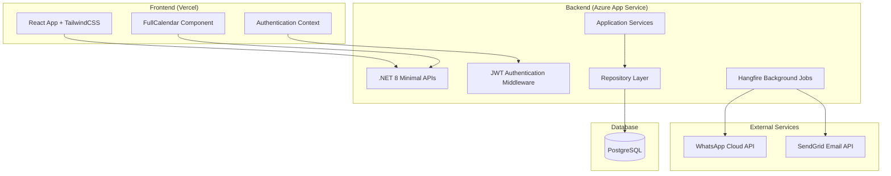
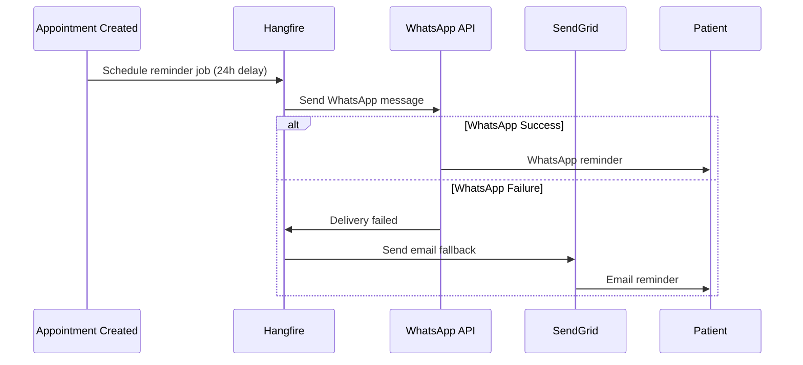

# Design Document

## Overview

The clinic appointment management system is designed as a modern web application with a React frontend and .NET 8 backend, following clean architecture principles. The system uses PostgreSQL for data persistence, implements JWT-based authentication, and integrates with external APIs for notifications. The architecture supports role-based access control and is designed for cloud deployment with horizontal scaling capabilities.

## Architecture

### High-Level Architecture



### Technology Stack

**Frontend:**
- React 18 with TypeScript
- TailwindCSS for styling
- shadcn/ui for modern, accessible React components
- FullCalendar for appointment visualization
- Axios for API communication
- React Router for navigation
- React Hook Form for form management
- Shadcn for modern React Components

**Backend:**
- .NET 8 with Minimal APIs
- Entity Framework Core for ORM
- Hangfire for background job processing
- JWT Bearer authentication
- FluentValidation for input validation
- Serilog for structured logging

**Database:**
- PostgreSQL 15+
- Entity Framework migrations for schema management

**External Integrations:**
- WhatsApp Cloud API for messaging
- SendGrid for email notifications

## Components and Interfaces

### Frontend Components

#### Authentication Components
- `LoginPage`: Handles user authentication with JWT token management using shadcn/ui Card and Form components
- `AuthContext`: React context for managing authentication state
- `ProtectedRoute`: Route wrapper for role-based access control

#### Dashboard Components
- `DoctorDashboard`: Main dashboard with calendar view using shadcn/ui layout components
- `AdminDashboard`: Administrative dashboard with shadcn/ui Tabs and DataTable components
- `CalendarView`: FullCalendar integration with shadcn/ui Dialog for appointment details

#### Appointment Management
- `AppointmentForm`: Create/edit appointment modal using shadcn/ui Dialog, Form, and DatePicker components
- `AppointmentList`: List view using shadcn/ui DataTable with filtering and sorting
- `AppointmentDetails`: Detailed view using shadcn/ui Card and Badge components for status

#### Patient Management
- `PatientForm`: Create/edit patient information using shadcn/ui Form components with validation
- `PatientList`: Searchable list using shadcn/ui DataTable with Command palette for search
- `PatientProfile`: Patient details using shadcn/ui Card layout with appointment history

### Backend API Endpoints

#### Authentication Endpoints
```
POST /api/auth/login
POST /api/auth/refresh
POST /api/auth/logout
```

#### Appointment Endpoints
```
GET /api/appointments
GET /api/appointments/{id}
POST /api/appointments
PUT /api/appointments/{id}
DELETE /api/appointments/{id}
GET /api/appointments/doctor/{doctorId}
```

#### Patient Endpoints
```
GET /api/patients
GET /api/patients/{id}
POST /api/patients
PUT /api/patients/{id}
DELETE /api/patients/{id}
GET /api/patients/search?query={query}
```

#### Admin Endpoints
```
GET /api/admin/appointments
GET /api/admin/doctors
GET /api/admin/statistics
```

### Service Layer Architecture

#### Application Services
- `AppointmentService`: Business logic for appointment management
- `PatientService`: Patient record management
- `AuthenticationService`: JWT token generation and validation
- `NotificationService`: Reminder scheduling and delivery
- `UserService`: User management and role assignment

#### Repository Pattern
- `IAppointmentRepository`: Data access abstraction for appointments
- `IPatientRepository`: Data access abstraction for patients
- `IUserRepository`: Data access abstraction for users
- `IUnitOfWork`: Transaction management across repositories

## Data Models

### Database Schema

```sql
-- Clinics table
CREATE TABLE Clinics (
    Id SERIAL PRIMARY KEY,
    Name VARCHAR(255) NOT NULL,
    Address TEXT,
    CreatedAt TIMESTAMP DEFAULT CURRENT_TIMESTAMP
);

-- Doctors table
CREATE TABLE Doctors (
    Id SERIAL PRIMARY KEY,
    ClinicId INTEGER REFERENCES Clinics(Id),
    Name VARCHAR(255) NOT NULL,
    Specialization VARCHAR(255),
    Email VARCHAR(255) UNIQUE NOT NULL,
    CreatedAt TIMESTAMP DEFAULT CURRENT_TIMESTAMP
);

-- Patients table
CREATE TABLE Patients (
    Id SERIAL PRIMARY KEY,
    ClinicId INTEGER REFERENCES Clinics(Id),
    Name VARCHAR(255) NOT NULL,
    Phone VARCHAR(20),
    Email VARCHAR(255),
    Notes TEXT,
    CreatedAt TIMESTAMP DEFAULT CURRENT_TIMESTAMP
);

-- Users table (for authentication)
CREATE TABLE Users (
    Id SERIAL PRIMARY KEY,
    ClinicId INTEGER REFERENCES Clinics(Id),
    DoctorId INTEGER REFERENCES Doctors(Id) NULL,
    Email VARCHAR(255) UNIQUE NOT NULL,
    PasswordHash VARCHAR(255) NOT NULL,
    Role VARCHAR(50) NOT NULL CHECK (Role IN ('Doctor', 'Admin')),
    CreatedAt TIMESTAMP DEFAULT CURRENT_TIMESTAMP
);

-- Appointments table
CREATE TABLE Appointments (
    Id SERIAL PRIMARY KEY,
    DoctorId INTEGER REFERENCES Doctors(Id),
    PatientId INTEGER REFERENCES Patients(Id),
    DateTime TIMESTAMP NOT NULL,
    Status VARCHAR(50) DEFAULT 'Scheduled' CHECK (Status IN ('Scheduled', 'Completed', 'Cancelled', 'NoShow')),
    Notes TEXT,
    CreatedAt TIMESTAMP DEFAULT CURRENT_TIMESTAMP,
    UNIQUE(DoctorId, DateTime) -- Prevent double booking
);

-- Indexes for performance
CREATE INDEX idx_appointments_doctor_datetime ON Appointments(DoctorId, DateTime);
CREATE INDEX idx_appointments_patient ON Appointments(PatientId);
CREATE INDEX idx_patients_clinic ON Patients(ClinicId);
CREATE INDEX idx_doctors_clinic ON Doctors(ClinicId);
```

### Entity Models (.NET)

```csharp
public class Appointment
{
    public int Id { get; set; }
    public int DoctorId { get; set; }
    public int PatientId { get; set; }
    public DateTime DateTime { get; set; }
    public AppointmentStatus Status { get; set; }
    public string? Notes { get; set; }
    public DateTime CreatedAt { get; set; }
    
    // Navigation properties
    public Doctor Doctor { get; set; }
    public Patient Patient { get; set; }
}

public class Patient
{
    public int Id { get; set; }
    public int ClinicId { get; set; }
    public string Name { get; set; }
    public string? Phone { get; set; }
    public string? Email { get; set; }
    public string? Notes { get; set; }
    public DateTime CreatedAt { get; set; }
    
    // Navigation properties
    public Clinic Clinic { get; set; }
    public ICollection<Appointment> Appointments { get; set; }
}
```

## Error Handling

### Frontend Error Handling
- Global error boundary for React component errors
- Axios interceptors for API error handling
- Toast notifications for user feedback
- Form validation with real-time feedback
- Network error detection and retry mechanisms

### Backend Error Handling
- Global exception middleware for unhandled exceptions
- Custom exception types for business logic errors
- Structured logging with correlation IDs
- API response standardization with error codes
- Validation error aggregation and formatting

### Error Response Format
```json
{
    "success": false,
    "error": {
        "code": "APPOINTMENT_CONFLICT",
        "message": "An appointment already exists for this time slot",
        "details": {
            "conflictingAppointmentId": 123,
            "suggestedTimes": ["2024-01-15T10:00:00Z", "2024-01-15T11:00:00Z"]
        }
    },
    "timestamp": "2024-01-15T09:30:00Z",
    "correlationId": "abc123-def456"
}
```

## Testing Strategy

### Frontend Testing
- **Unit Tests**: Jest and React Testing Library for component testing
- **Integration Tests**: API integration testing with MSW (Mock Service Worker)
- **E2E Tests**: Playwright for critical user journeys
- **Accessibility Tests**: axe-core integration for WCAG compliance

### Backend Testing
- **Unit Tests**: xUnit for service and repository layer testing
- **Integration Tests**: WebApplicationFactory for API endpoint testing
- **Database Tests**: In-memory PostgreSQL for repository testing
- **Background Job Tests**: Hangfire job execution testing

### Test Coverage Goals
- Minimum 80% code coverage for business logic
- 100% coverage for critical paths (authentication, appointment booking)
- Performance testing for concurrent appointment booking scenarios

### Notification System Design

#### Hangfire Background Jobs
- **Reminder Scheduler**: Schedules reminder jobs when appointments are created
- **Reminder Processor**: Executes reminder delivery 24 hours before appointments
- **Retry Logic**: Exponential backoff for failed notifications
- **Dead Letter Queue**: Failed notifications after max retries

#### Notification Flow


### Security Considerations
- JWT token expiration and refresh mechanism
- Password hashing using BCrypt
- SQL injection prevention through parameterized queries
- CORS configuration for frontend-backend communication
- Rate limiting for API endpoints
- Input validation and sanitization
- HTTPS enforcement in production